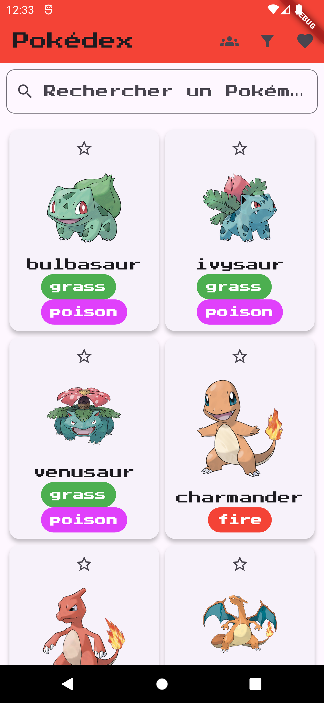
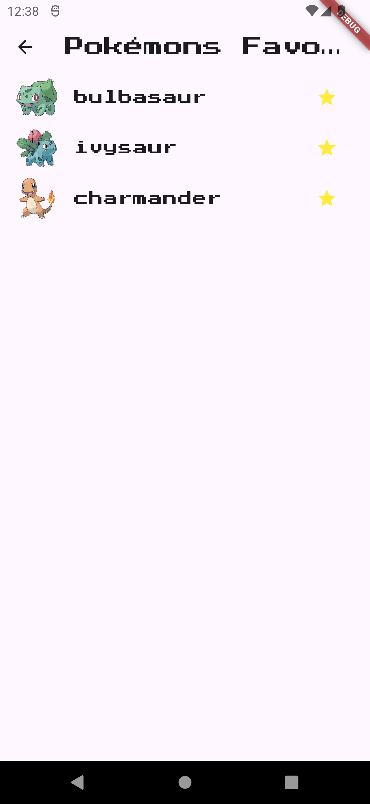
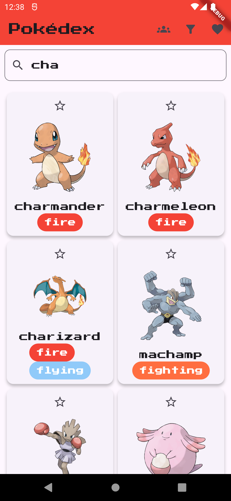
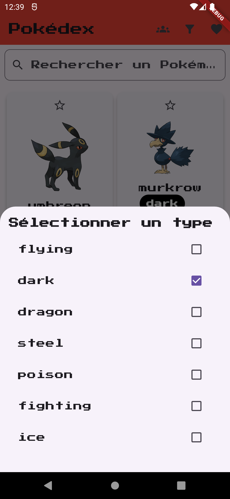
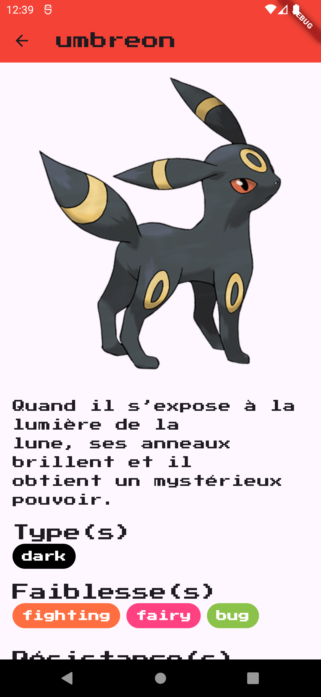
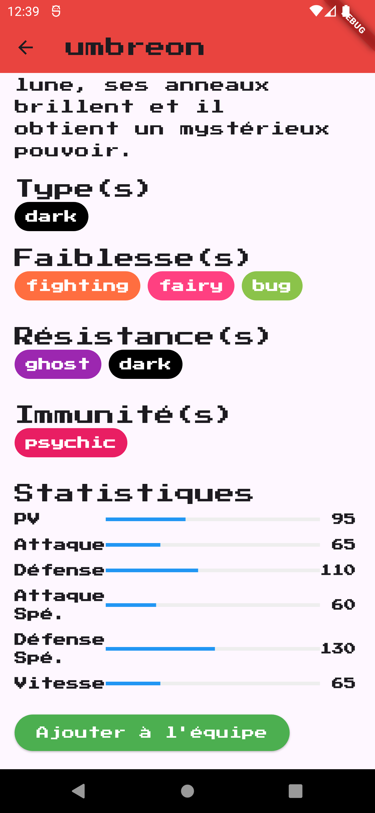
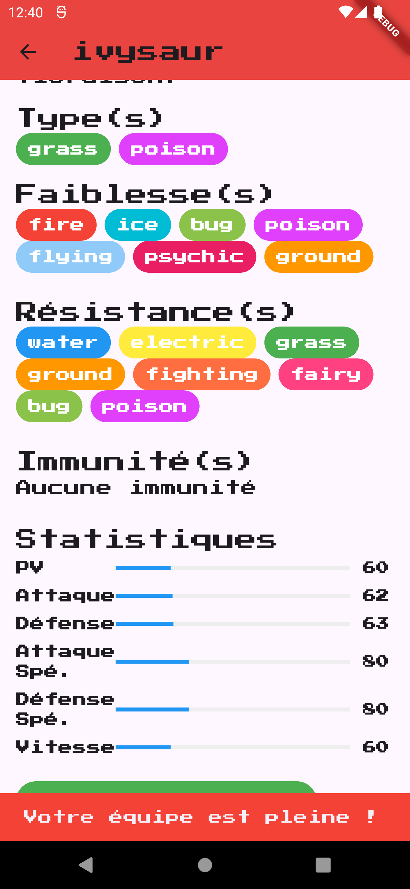
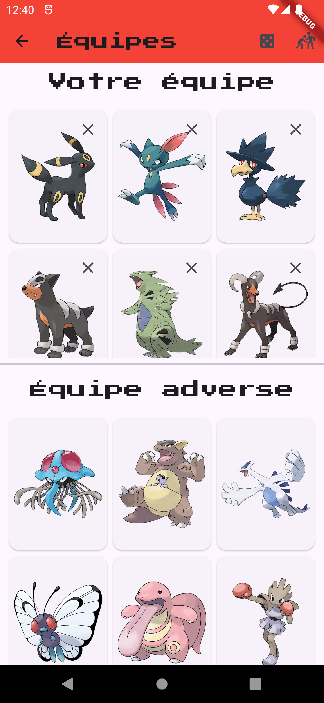
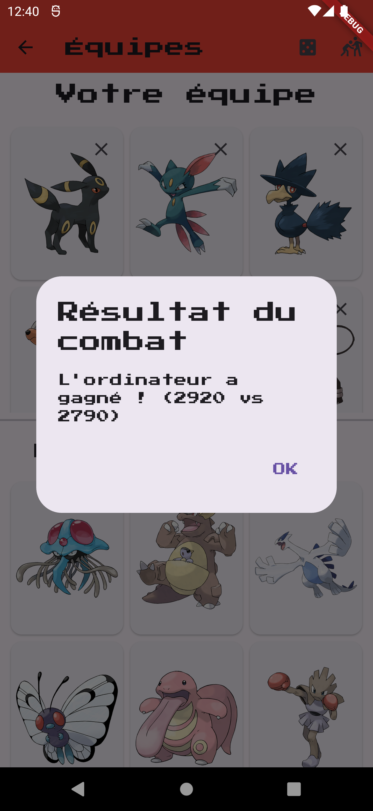

# Crédits

Réaliser par Nicolas LEIRITZ dans le cadre d'un apprentissage Flutter au CESI de Vandoeuvre

# pokemon_project

Création d'un pokédex avec un système de composition d'équipe, composition aléatoire de l'équipe adverse et système de combat.

# Combat

Les combats sont la somme de toutes les bases des pokémon composant chaque équipe. La valeur total la plus haute gagne.

# Filtres

Il est possible de rechercher un pokemon par son nom (Anglais) ou par son type.

# Captures

Au lancement de l'application :

On peut mettre les pokémons en favoris :

On peut les retrouver dans une liste en cliquant sur le coeur présent dans l'AppBar :

On peut les trier par le nom ou par le type via le champ de recherche ou la seconde icone de l'AppBar :

On a une description avec les stats, les faiblesses, forces et immunités :

On peut ajouter 6 pokemon dans une équipe. Si cette dernière est pleine :

On peut accéder à la page du combat via la première icone dans l'AppBar. L'équipe adverse peut être généré aléatoirement via l'icone du dé :

On lance le combat avec la seconde icone. Le combat est une simple somme des base stats de chaque pokemon composant l'équipe.
